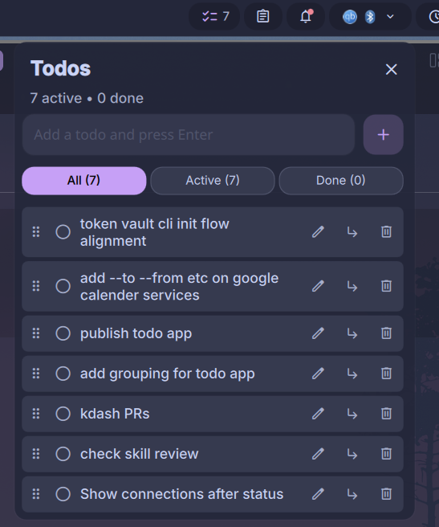

# Dank Todo

A simple, locally-saved TODO list widget for the [DankMaterialShell](https://github.com/AvengeMedia/DankMaterialShell) bar.



## Features

- Quick-add input (Enter to submit) right in the popout
- One-click toggle between active/completed
- Per-item delete (cascades to subtasks) and "Clear completed" both soft-delete items in storage
- Filter chips: All / Active / Done
- **Drag-and-drop reordering and nesting** — grab the handle on the left, drop above or below another todo to reorder, or drop _onto_ a todo to make it a subtask
- Unlimited nesting depth, with indented display
- Pill count mode — show active, total, done, or hide the badge
- Storage location configurable; defaults to `$XDG_CONFIG_HOME/dank-todo/todos.json`
- Atomic JSON writes, safe against corruption
- IPC commands for scripting and keybindings

## Installation

### Via DMS GUI

1. Open DMS Settings (`Mod` + `,`)
2. Go to the Plugins tab → Browse → enable third-party plugins
3. Install **Dank Todo**
4. Enable it with the toggle, then add the widget to a bar section

### Via DMS CLI

```bash
dms plugins install dankTodo
```

### Manually

```bash
cd ~/.config/DankMaterialShell/plugins
git clone https://github.com/deepu105/dms-dank-todo dankTodo
```

Then in DMS Settings → Plugins, click "Scan for Plugins" and enable **Dank Todo**.

## Usage

Click the pill in the bar to open the popout. Type a todo and press Enter. Click the circle to toggle, the trash icon to delete, or "Clear completed" to hide done items. Deleted items stay in the JSON file with a `deletedAt` timestamp and are omitted from the UI.

Each row also has edit (`✎`) and subtask (`⤵`) buttons next to delete:

- **Edit** — populates the main input with the row's text and switches to "Editing: …" mode. Enter saves, Escape (or the × on the chip) cancels.
- **Subtask** — switches the main input to "Subtask of: …" mode. Enter adds the new todo as a child of that row, Escape (or ×) cancels.

The two modes are exclusive — triggering one clears the other. The + button on the input turns into a ✓ when editing.

**Reordering and grouping**: each row has a drag handle on the left in All, Active, and Done. While dragging:

- Drop in the **top quarter** of a row → insert as a sibling **before** it
- Drop in the **bottom quarter** → insert as a sibling **after** it (after its entire subtree)
- Drop in the **middle** → become a **child** of that row (indented below it)

A blue line marks sibling drops; a tinted background marks child drops. Dropping a todo onto itself or onto one of its own descendants is blocked.

## Settings

- **Storage directory** — override the default `$XDG_CONFIG_HOME/dank-todo` location
- **Bar pill count** — Active / Total / Done / Hidden
- **Maximum todos** — cap the list size (default 200)
- **Maximum characters per todo** — longer entries are truncated (default 500)

## IPC

```bash
dms ipc call dankTodo add "Buy milk"
dms ipc call dankTodo addChild "Whole milk" <parentId>
dms ipc call dankTodo edit <id> "New text"
dms ipc call dankTodo toggle <id>
dms ipc call dankTodo remove <id>
dms ipc call dankTodo move <sourceId> <targetId> <position>   # position: before | after | child
dms ipc call dankTodo clearDone
dms ipc call dankTodo list       # returns JSON array
dms ipc call dankTodo count      # returns "active/total"
```

Great for binding "add todo from current clipboard" to a key in your compositor.

### Niri keybinding example

```kdl
binds {
    Mod+Shift+T hotkey-overlay-title="Add clipboard to Todo" {
        spawn "sh" "-c" "dms ipc call dankTodo add \"$(wl-paste -n)\"";
    }
}
```

## Data format

Todos are stored as plain JSON. Back it up or sync it however you like:

```json
{
  "version": 2,
  "todos": [
    {
      "id": "parent-1",
      "text": "Shopping",
      "completed": false,
      "parentId": null,
      "createdAt": "2026-04-22T14:00:00.000Z"
    },
    {
      "id": "child-1",
      "text": "Buy milk",
      "completed": false,
      "parentId": "parent-1",
      "createdAt": "2026-04-22T14:00:10.000Z"
    }
  ]
}
```

Array order is display order; `parentId: null` means top-level. Soft-deleted items are retained in storage with `deletedAt` set and are filtered out of the UI and counts. The loader migrates older `version: 1` files automatically by defaulting `parentId` to `null`.

## Requirements

- DankMaterialShell
- Niri window manager (though the plugin has no compositor-specific code)

## License

MIT
